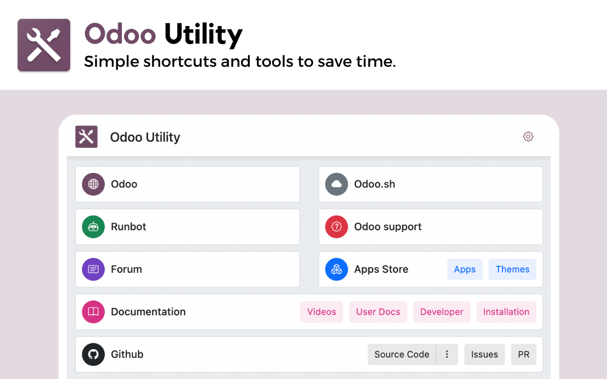
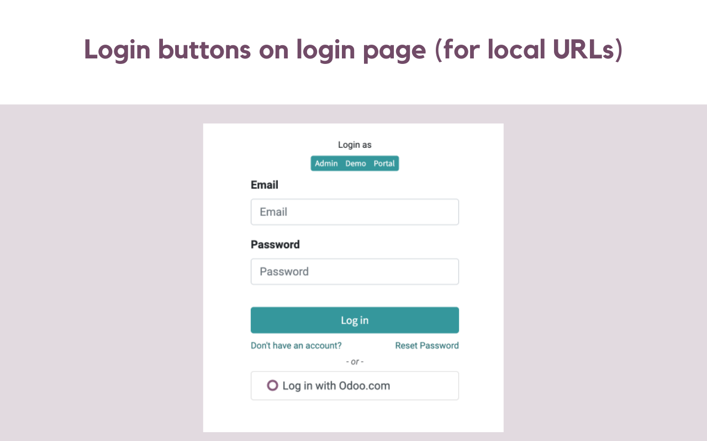
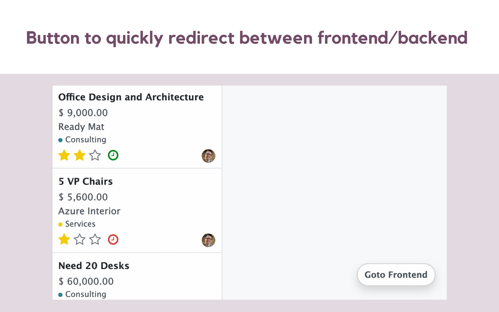
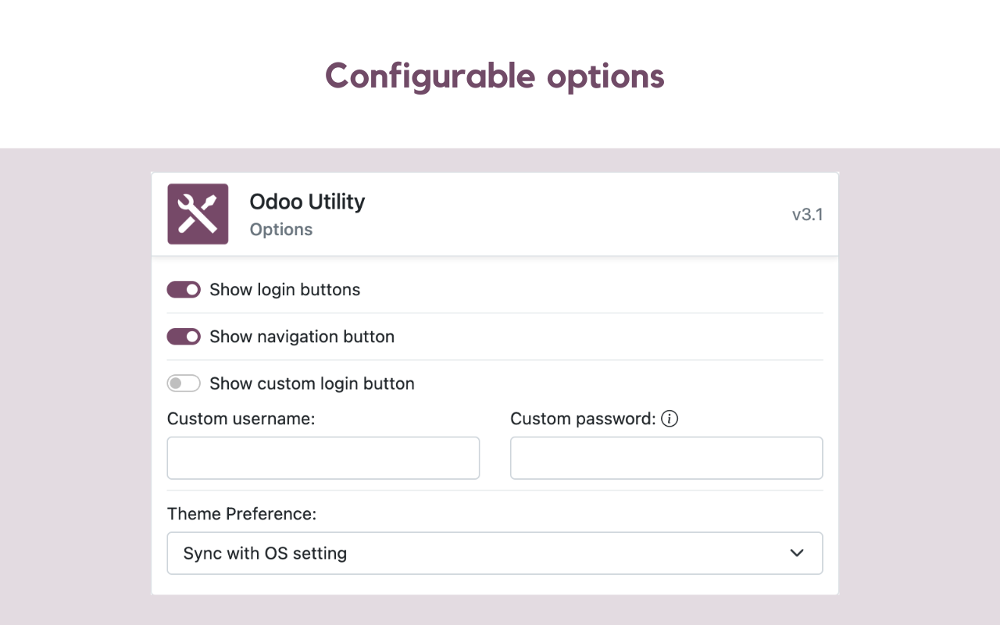

<h1 align="center" style="border-bottom: 0px;">
    
    
Odoo Utility

    

        
        
        
    

    

        
        
        
    

</h1>

Simple shortcuts and tools to save time.

    
    
    
    

## Installation
- Install from <a href="https://chrome.google.com/webstore/detail/odoo-utility/jllbemjkkabaohnjcnajhflahlkehmlf">Chrome Web Store</a>
- Install from <a href="https://addons.mozilla.org/en-US/firefox/addon/odoo-utility/">Firefox Add-ons</a>

## Features
- Bookmark of daily used links.
- Quick login buttons on login page.
- Navigation button to quickly redirect between frontend or backend.

## Contributors

## Release Notes

Detailed release notes are available [here](CHANGELOG.md).

## License

Code licensed under [MIT](LICENSE).

## Other Tools
- [Odoo Debug](https://github.com/Droggol/OdooDebug) Browser Extension
- [Odoo Snippets](https://github.com/Droggol/VscOdooSnippets) for Visual Studio Code
